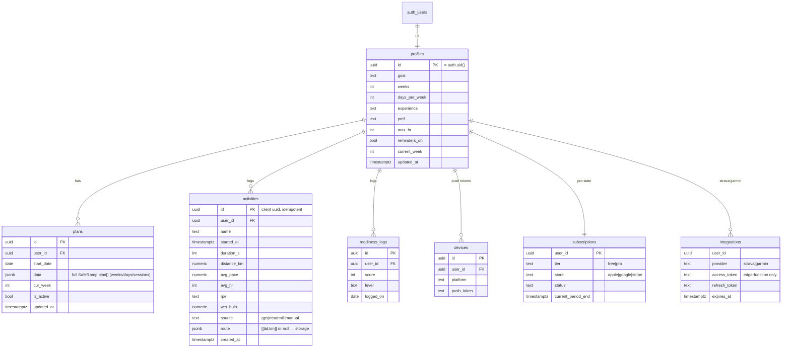
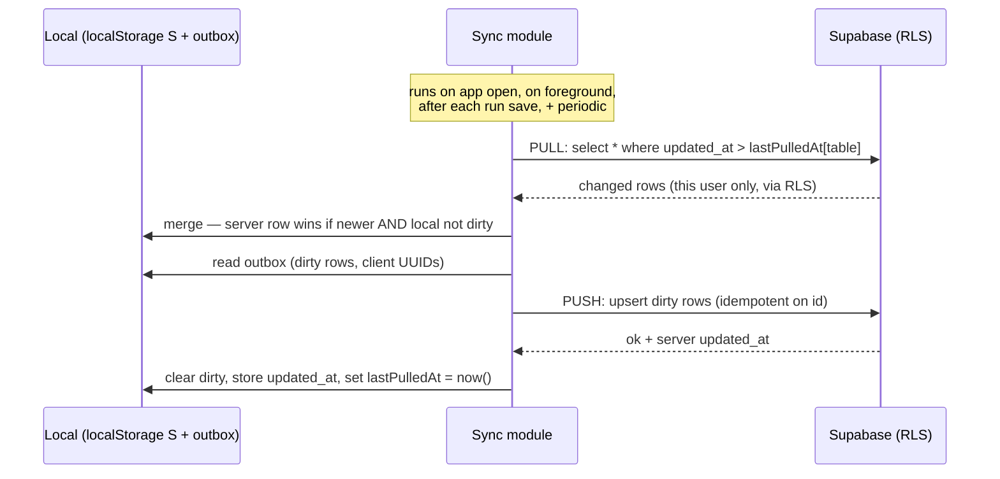

# ☁️ Backend blueprint — Supabase schema + sync

> **Status: design only. Nothing is built.** Strivon runs 100% on-device today. This is the ready-to-go plan for the first backend (accounts + cloud sync), to stand up *after* the free app proves retention.

## Principles
1. **Offline-first.** `localStorage` (`S`) stays the working copy; the backend is a sync target, not a dependency. The app must work with zero connectivity.
2. **Client-generated UUIDs** for every row → offline creates are idempotent (safe to re-upsert).
3. **Last-write-wins** on mutable data via `updated_at`; **activities are append-only/immutable** (no conflicts).
4. **RLS everywhere** — a user can only ever touch their own rows (`auth.uid() = user_id`).
5. **Minimal.** Supabase (Postgres + Auth + Storage) + 2–3 edge functions. Free tier until thousands of MAU.

## ✅ Built — turn it on in ~5 minutes
The client (auth UI + offline-first sync engine) is **built and wired** (`app/config.js`, `app/sync.js`, vendored `app/vendor/supabase.js`, Account card on the **Why** tab). It's **inert until you add keys** — the app runs 100% offline with `config.js` blank. To enable cloud accounts + sync:

1. Create a **free Supabase project** at supabase.com.
2. **SQL Editor** → paste [`supabase/migrations/0001_accounts_sync.sql`](supabase/migrations/0001_accounts_sync.sql) → **Run**. (Creates tables, RLS, triggers, auto-profile-on-signup.)
3. *(For fast testing)* **Authentication → Providers → Email** → turn **off "Confirm email"** (or leave on and confirm via the email link).
4. **Project Settings → API** → copy the **Project URL** and the **anon public** key.
5. Paste both into **`app/config.js`**, then `./deploy.sh` (or reload locally).
6. Open the app → **Why** tab → **Create account**. Your plan + runs now back up to the cloud. Sign in on another device → everything restores.

**Verified so far (offline path + data mapping):** app is unaffected with blank config; Supabase JS loads; local↔cloud row mappers round-trip losslessly (plan, profile, activities). **Not yet verified:** the live cloud round-trip (auth/RLS/upsert/merge) — that needs *your* Supabase project or a local `supabase start` stack. The code is written to the Supabase-JS v2 API.

## Data model (ERD)



## Schema (SQL)

```sql
-- profiles: 1:1 with auth.users, keyed by the auth uid
create table profiles (
  id uuid primary key references auth.users(id) on delete cascade,
  email text,
  display_name text,
  goal text, goal_name text, weeks int, days_per_week int,
  experience text, pref text,
  max_hr int default 190,
  units text default 'metric',
  reminders_on boolean default false,
  current_week int default 1,
  created_at timestamptz default now(),
  updated_at timestamptz default now()
);

-- plans: the SafeRamp plan stored as JSONB (mutated as a whole by the client engine)
create table plans (
  id uuid primary key default gen_random_uuid(),
  user_id uuid not null references auth.users(id) on delete cascade,
  goal text, goal_name text, weeks int, days int, experience text, pref text,
  start_date date,
  data jsonb not null,           -- == S.plan (array of weeks incl days/sessions)
  cur_week int default 1,
  is_active boolean default true,
  created_at timestamptz default now(),
  updated_at timestamptz default now()
);
create index on plans (user_id, is_active);

-- activities: completed runs, append-only & immutable
create table activities (
  id uuid primary key,           -- client-generated → idempotent upsert
  user_id uuid not null references auth.users(id) on delete cascade,
  name text,
  started_at timestamptz not null,
  duration_s int, distance_km numeric, avg_pace numeric,
  avg_hr int, rpe text, wet_bulb numeric,
  source text default 'gps',
  route jsonb,                   -- small routes inline; large → storage bucket + route_url
  created_at timestamptz default now()
);
create index on activities (user_id, started_at desc);

create table readiness_logs (
  id uuid primary key default gen_random_uuid(),
  user_id uuid not null references auth.users(id) on delete cascade,
  score int, level text,
  logged_on date not null,
  created_at timestamptz default now(),
  unique (user_id, logged_on)    -- one per day
);

create table devices (
  id uuid primary key default gen_random_uuid(),
  user_id uuid not null references auth.users(id) on delete cascade,
  platform text, push_token text,
  last_seen timestamptz default now(),
  unique (user_id, push_token)
);

create table subscriptions (
  user_id uuid primary key references auth.users(id) on delete cascade,
  tier text default 'free',
  store text, status text,
  current_period_end timestamptz,
  raw jsonb,
  updated_at timestamptz default now()
);

create table integrations (
  user_id uuid references auth.users(id) on delete cascade,
  provider text,
  access_token text, refresh_token text, expires_at timestamptz,
  athlete_id text,
  updated_at timestamptz default now(),
  primary key (user_id, provider)
);

-- auto-touch updated_at on mutable tables
create or replace function set_updated_at() returns trigger language plpgsql as $$
begin new.updated_at = now(); return new; end $$;
create trigger t_profiles  before update on profiles  for each row execute function set_updated_at();
create trigger t_plans     before update on plans     for each row execute function set_updated_at();
```

## Row-Level Security (the whole security model)

```sql
alter table profiles       enable row level security;
alter table plans          enable row level security;
alter table activities     enable row level security;
alter table readiness_logs enable row level security;
alter table devices        enable row level security;
alter table subscriptions  enable row level security;
alter table integrations   enable row level security;

-- profiles: keyed by id = auth.uid()
create policy "own profile" on profiles
  for all using (auth.uid() = id) with check (auth.uid() = id);

-- every other user-owned table: user_id = auth.uid()
create policy "own rows" on plans
  for all using (auth.uid() = user_id) with check (auth.uid() = user_id);
-- (repeat identical policy for activities, readiness_logs, devices, subscriptions)

-- integrations: user may READ connection status but NOT the tokens.
-- tokens are written/read only by edge functions using the service_role key (bypasses RLS).
create policy "own integration status" on integrations
  for select using (auth.uid() = user_id);
-- no insert/update policy for clients → only service_role can write tokens.
```

## Sync design (offline-first, delta, last-write-wins)



**Rules**
- **Activities**: insert-only, client UUID → `upsert` is idempotent; never conflict. Deleting a run = hard delete (or a `deleted_at` tombstone synced like any change).
- **Profile / plan / subscription**: mutable → **LWW by `updated_at`**. Same-user edits are near-sequential, so real conflicts are rare; on tie, server wins.
- **Outbox**: wrap every local write so it also marks the record dirty (a `Set` of `{table,id}` persisted in localStorage). Push drains it.
- **Cursors**: `lastPulledAt[table]` per table in localStorage. Pull is a cheap delta, not a full download.
- **Realtime (optional, phase 2):** `supabase.channel(...)` on `plans`/`activities` for live cross-device updates (e.g., watch ↔ phone).

### Client sync module (sketch — drops in next to native-bridge.js)
```js
// pseudo — reconciles localStorage S with Supabase
async function sync(sb){
  if(!navigator.onLine || !sb.auth.user) return;
  const uid = sb.auth.user.id, cur = loadCursors();
  // PULL deltas
  for (const t of ['profiles','plans','activities','readiness_logs','subscriptions']){
    const { data } = await sb.from(t).select('*').gt('updated_at', cur[t]||'1970-01-01');
    mergeIntoLocal(t, data);            // server wins if newer && !localDirty(id)
    cur[t] = new Date().toISOString();
  }
  // PUSH outbox
  for (const { table, id } of drainOutbox()){
    const row = localRow(table, id);
    await sb.from(table).upsert({ ...row, user_id: uid });   // idempotent on id
  }
  saveCursors(cur);
}
```

## Auth
Supabase Auth with **Sign in with Apple** (needed for the iOS App Store if you offer social login), **Google**, and **email magic link**. On first sign-in, run **migration**: if the server has no profile for this user, upload the local `S` (profile + active plan + bulk-insert activities by UUID). If the server *does* have data, pull + merge (LWW). `localStorage` stays as the offline cache.

## Edge functions (serverless, service_role)
| Function | Job |
|---|---|
| `strava-oauth` | Exchange the OAuth `code`, store tokens in `integrations` (bypassing RLS) |
| `strava-webhook` | Receive Strava activity events; pull the workout |
| `strava-refresh` | Refresh expired access tokens |
| `verify-receipt` | Validate App Store / Play / Stripe receipt → update `subscriptions.tier` |
| `push-send` | Trigger FCM/APNs for remote/re-engagement push |

Secrets (Strava client secret, APNs key) live in edge-function env, never in the app.

## Build order & cost
1. **Accounts + cloud sync** (this doc) — profiles, plans, activities, readiness + RLS + sync module. Foundation.
2. **Payments / Pro gating** — `subscriptions` + `verify-receipt`.
3. **Strava/Garmin OAuth sync** — `integrations` + edge functions.
4. **Remote push** — `devices` + `push-send`.
5. **Community / support** — later, if ever (new tables + moderation).

**Cost:** Supabase free tier (500MB DB, 50k MAU auth, 1GB storage) covers the first thousands of users. Pro (~£20/mo) only when you outgrow it. Edge functions are pay-per-call (negligible early).
