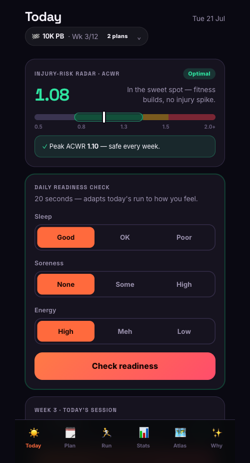
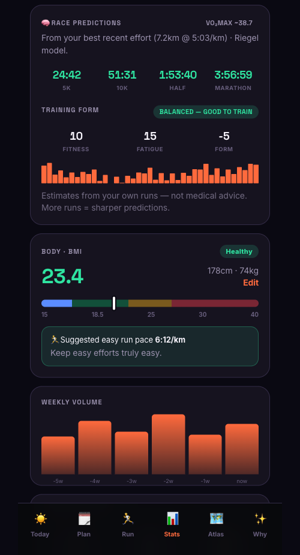
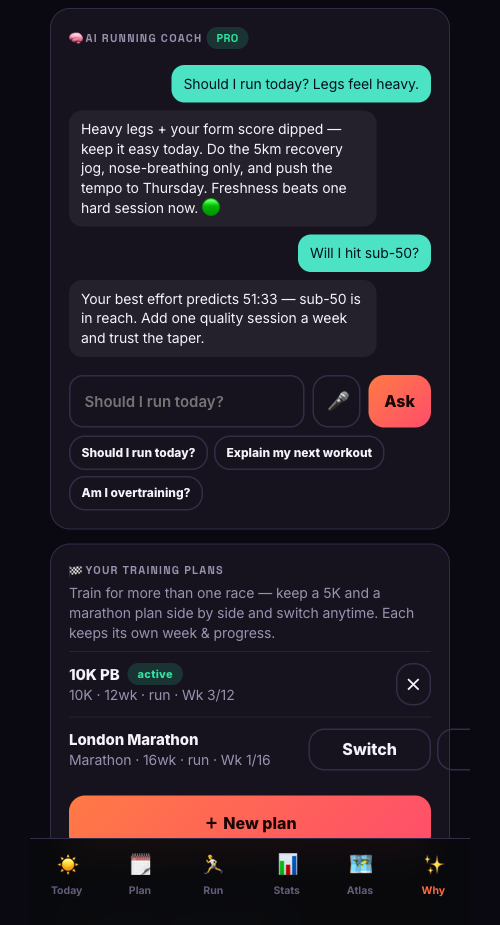
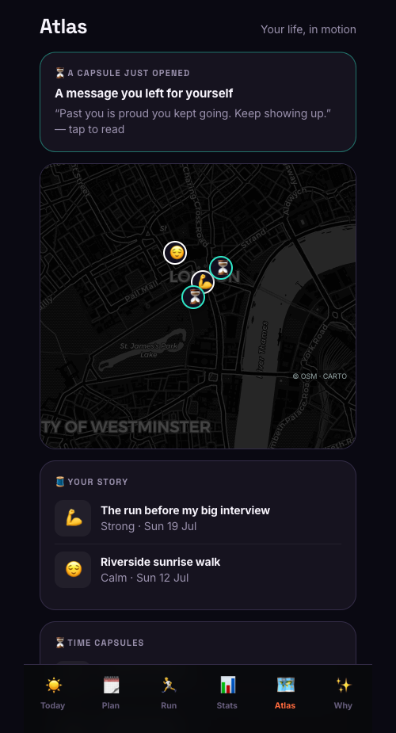
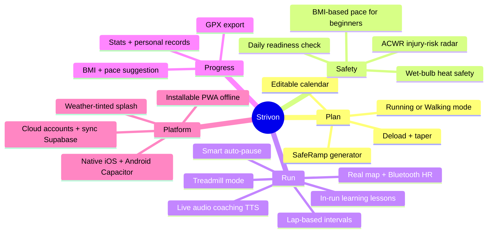
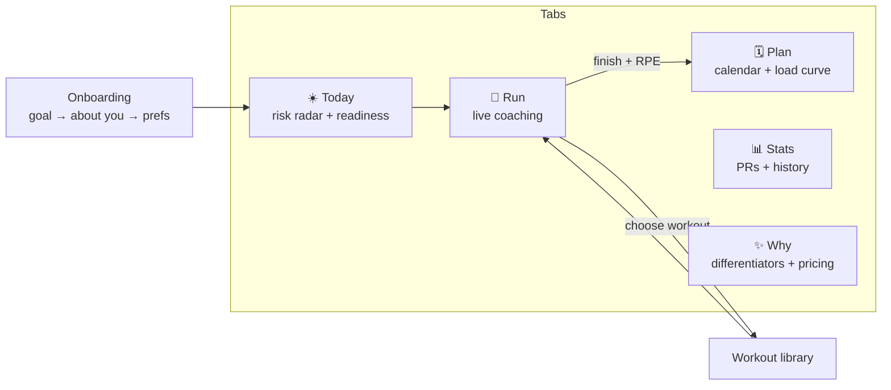
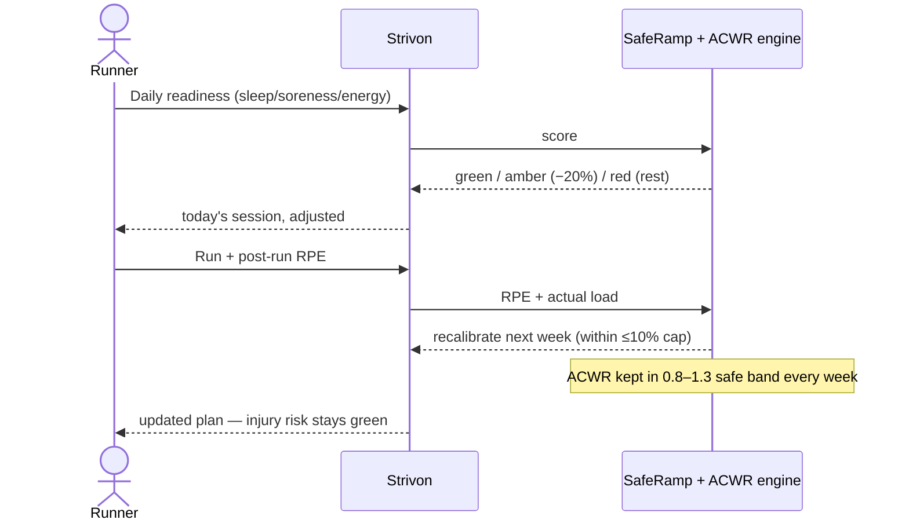
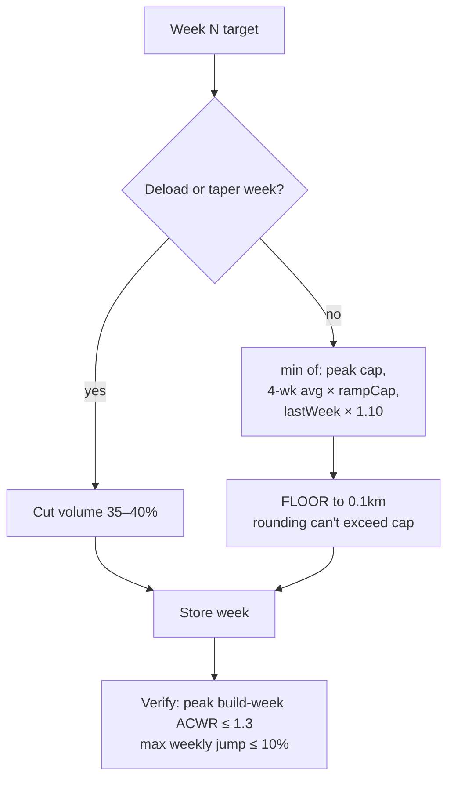

# 🏃 Strivon

> **The running coach that won't get you injured.**
> An adaptive running-plan & coaching app built around injury-safety: load that can't ramp too fast, a real feedback loop, accurate GPS, wet-bulb heat awareness, and honest pricing.

App **#1 of 30**. Single self-contained web prototype (`app/index.html`) — no build step, no backend.

### 🔴 Live demo → **[soumyadg.github.io/stride-coach](https://soumyadg.github.io/stride-coach/)**  ·  installable PWA · works on mobile

<p align="center">
  
  
  
  
</p>

### 🗺️ Where this is going → **[Product vision: Strivon Atlas](docs/vision.html)**
> Not just a tracker — a *geographical autobiography*: your journeys fused with memories, future-self time capsules, an AI companion, a real-world RPG and a legacy that outlives you. See [`docs/vision.html`](docs/vision.html) for the full 18-part strategy (open it in a browser).

---

## Screens

<table>
  <tr>
    <td width="33%"></td>
    <td width="33%"></td>
    <td width="33%"></td>
  </tr>
  <tr>
    <td align="center"><b>Today</b><br><sub>Injury-risk radar + multi-plan</sub></td>
    <td align="center"><b>Smart insights</b><br><sub>On-device race predictions · VO₂max · form</sub></td>
    <td align="center"><b>AI coach + voice</b><br><sub>Claude, grounded in your data · mic input</sub></td>
  </tr>
  <tr>
    <td></td>
    <td></td>
    <td></td>
  </tr>
  <tr>
    <td align="center"><b>🗺️ Atlas</b><br><sub>Life story map · memories · time capsules</sub></td>
    <td align="center"><b>Live run coaching</b><br><sub>Real map · Bluetooth HR · voice</sub></td>
    <td align="center"><b>Stats &amp; records</b><br><sub>PRs + one-tap GPX export</sub></td>
  </tr>
  <tr>
    <td></td>
    <td></td>
    <td></td>
  </tr>
  <tr>
    <td align="center"><b>Honest free vs Pro</b><br><sub>Safety promise always free</sub></td>
    <td align="center"><b>Plan-building animation</b><br><sub>Neon Aurora theme</sub></td>
    <td></td>
  </tr>
</table>

---

## Why it exists

Most running apps optimise for a plan; **Strivon optimises so the plan won't injure you.** Every design choice targets a real, documented failure mode in mainstream running apps:

| Common failure mode | Strivon's fix |
|---|---|
| Load ramps too fast → injuries | **SafeRamp** — load mathematically cannot jump >10%/week |
| One-time plan, no feedback loop | **Daily readiness** + **post-run RPE** recalibration |
| GPS undercounts 100–200m at corners | Smoothed distance, no undercount |
| Nags "speed up" at red lights | **Smart auto-pause** |
| No free tier, can't cancel in-app | Real free tier, £6.99 Pro, 1-tap cancel |
| No injury-risk or heat modelling | **ACWR radar** + **wet-bulb heat** safety (sports-science standard) |

---

## Feature map



## App navigation



## The injury-safe adaptive loop (our moat)



## SafeRamp — why an unsafe plan is impossible



---

## Run it

```bash
cd app
python3 -m http.server 8791
# open http://localhost:8791/index.html  (use a phone / mobile viewport)
```
Or open `app/index.html` directly (GPS tracking needs http/https + location permission; falls back to demo mode otherwise).

## What's built (all free & working)

| Area | Capabilities |
|---|---|
| **Plan** | SafeRamp generator (≤10%/wk, deloads, taper), editable calendar, **Running or Walking** mode |
| **Safety** | ACWR injury-risk radar, daily readiness, **wet-bulb heat** (5-bucket app theme + warnings), **BMI-based pace** for beginners |
| **Run** | Lap-based intervals, live voice coaching, **in-run learning lessons**, smart auto-pause, real dark map, **Bluetooth HR** zones, **treadmill** mode |
| **Progress** | Stats, personal records, **BMI**, one-tap **GPX export** |
| **Platform** | Installable **PWA** (offline), native **iOS + Android** (Capacitor), cloud **accounts + sync** (Supabase), weather-tinted splash |

> Everything above works today, for free. **Pro** (Stripe) and store distribution are set up but not switched on — see the docs below.

## Docs

- **[NATIVE.md](NATIVE.md)** — build the native iOS/Android app (Capacitor)
- **[BACKEND.md](BACKEND.md)** — Supabase schema + offline-first sync design
- **[PRO.md](PRO.md)** — Stripe subscriptions + Pro gating (web only; App Store needs IAP)
- **[tests/](tests/)** — unit + stress + smoke battery (`await runStrideTests()`)
- **[research/](research/)** — market research, competitor analysis, blueprint

## Run it

```bash
cd app && python3 -m http.server 8791
# open http://localhost:8791/index.html  (mobile viewport)
```
Live: **[soumyadg.github.io/stride-coach](https://soumyadg.github.io/stride-coach/)** · Landing: **[/landing.html](https://soumyadg.github.io/stride-coach/landing.html)**

## Tech

- **Single-file** `app/index.html` — vanilla HTML/CSS/JS, `localStorage`, plus optional Supabase sync.
- Web APIs: Geolocation, SpeechSynthesis, Web Bluetooth, SVG map tiles, Notifications.
- Theme **"Neon Aurora"**; brand mark + logo set in `app/brand/`.
- Native shell via **Capacitor** (`ios/`, `android/`).

## Repo layout

```
stride-coach/
├── app/
│   ├── index.html          # the whole app
│   ├── config.js           # Supabase + Stripe keys (blank = fully offline)
│   ├── sync.js             # offline-first cloud sync
│   ├── native-bridge.js    # native GPS / BLE / Health / notifications
│   ├── landing.html        # marketing landing page
│   ├── brand/              # runner logo set (mark, app-icon, wordmarks)
│   └── screenshots/
├── ios/  · android/         # Capacitor native projects
├── supabase/migrations/     # accounts + sync schema (SQL)
├── supabase/functions/      # Stripe checkout + webhook (edge functions)
├── tests/                   # unit + stress + smoke battery
├── research/                # market research + blueprint
├── NATIVE.md · BACKEND.md · PRO.md · STATE.md
└── README.md
```

---

*Prototype built autonomously as app #1 of a 30-app sprint. Strivon is its own brand and product.*
