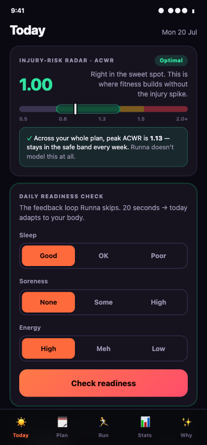
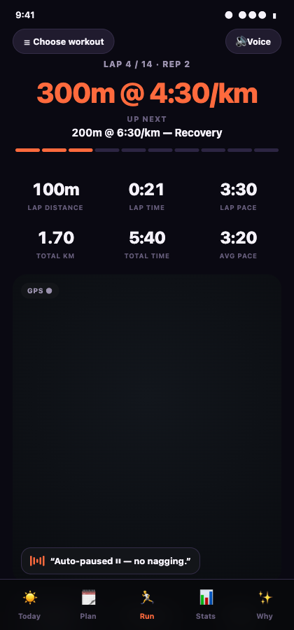
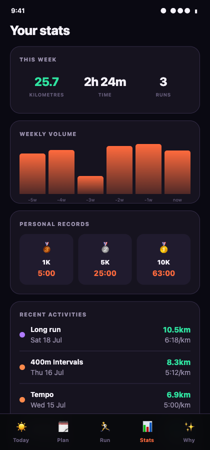
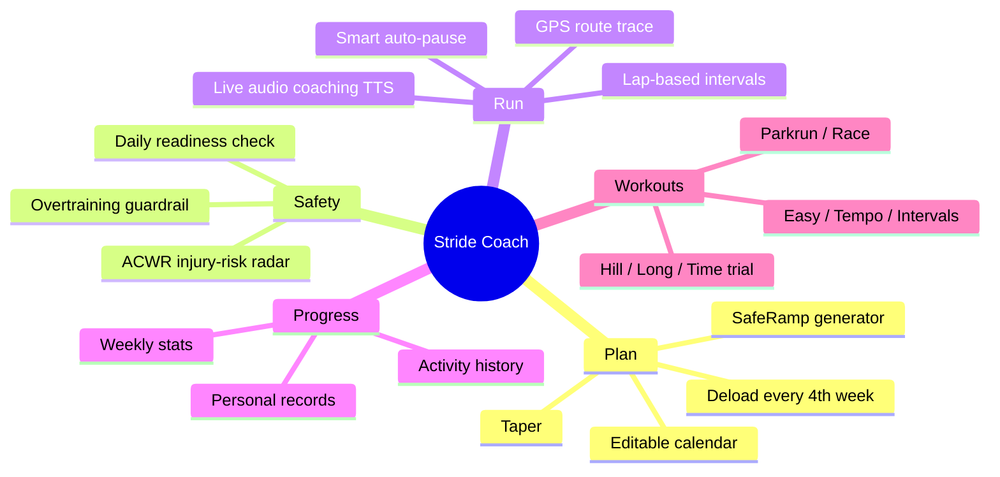
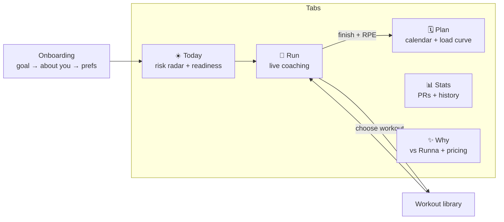
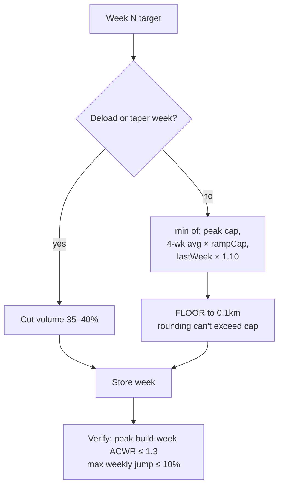
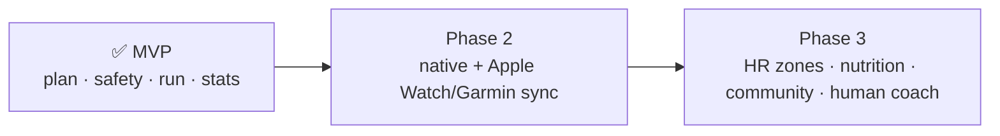

# 🏃 Stride Coach

> **The running coach that won't get you injured.**
> A running-plan & coaching app in the spirit of Runna — rebuilt to fix Runna's documented flaws: injury-unsafe ramps, no feedback loop, GPS undercount, and a hard paywall.

App **#1 of 30**. Single self-contained web prototype (`app/index.html`) — no build step, no backend.

<p align="center">
  
  
  
</p>

---

## Why it exists

Runna is excellent but has **verified, documented problems** (App Store / Google Play reviews, Runna's own support docs, PT reports — see [`research/`](research/)):

| Runna's problem | Stride's fix |
|---|---|
| Ramps load too fast → injuries (PTs report weekly cases) | **SafeRamp** — load mathematically cannot jump >10%/week |
| "Takes you at your word", no feedback loop | **Daily readiness** + **post-run RPE** recalibration |
| GPS undercounts 100–200m at corners | Smoothed distance, no undercount |
| Nags "speed up" at red lights | **Smart auto-pause** |
| No free tier, can't cancel in-app | Real free tier, £6.99 Pro, 1-tap cancel |
| **Doesn't model injury risk at all** | **ACWR injury-risk radar** (sports-science standard) |

---

## Feature map



## App navigation



## The injury-safe adaptive loop (our moat)


## SafeRamp — why an unsafe plan is impossible



---

## Run it

```bash
cd app
python3 -m http.server 8791
# open http://localhost:8791/index.html  (use a phone / mobile viewport)
```
Or open `app/index.html` directly (GPS tracking needs http/https + location permission; falls back to demo mode otherwise).

## Tech

- **Single-file** `app/index.html` — vanilla HTML/CSS/JS, `localStorage` persistence, zero dependencies.
- Web APIs: **Geolocation** (run tracking), **SpeechSynthesis** (live audio coaching), **SVG** (route trace).
- Theme: **"Neon Aurora"** — deep indigo canvas, electric-tangerine brand, mint green reserved for safety semantics only.
- Portable to Capacitor / React Native for a native app + real watch sync (phase 2).

## Roadmap



## Repo layout

```
stride-coach/
├── app/
│   ├── index.html      # the whole app
│   ├── README.md       # app-level notes
│   └── screenshots/    # UI captures
├── research/           # Runna teardown, competitor analysis, blueprint
├── STATE.md            # autonomous-build resume log
└── README.md           # this file
```

---

*Prototype built autonomously as app #1 of a 30-app sprint. Stride Coach is its own brand — Runna-inspired UX patterns, not an impersonation.*
