<p align="center">
  <picture>
    <source media="(prefers-color-scheme: dark)" srcset="app/branding/logo-full-dark.svg">
    
  </picture>
</p>

> **The running coach that won't get you injured.**
> An adaptive running-plan & coaching app built around injury-safety: load that can't ramp too fast, a real feedback loop, accurate GPS, wet-bulb heat awareness, and honest pricing.

App **#1 of 30**. Single self-contained web prototype (`app/index.html`) — no build step, no backend.

### 🔴 Live demo → **[soumyadg.github.io/stride-coach](https://soumyadg.github.io/stride-coach/)**  ·  installable PWA · works on mobile

<p align="center">
  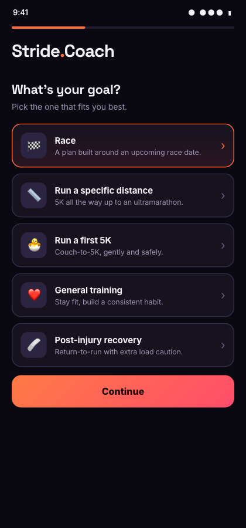
  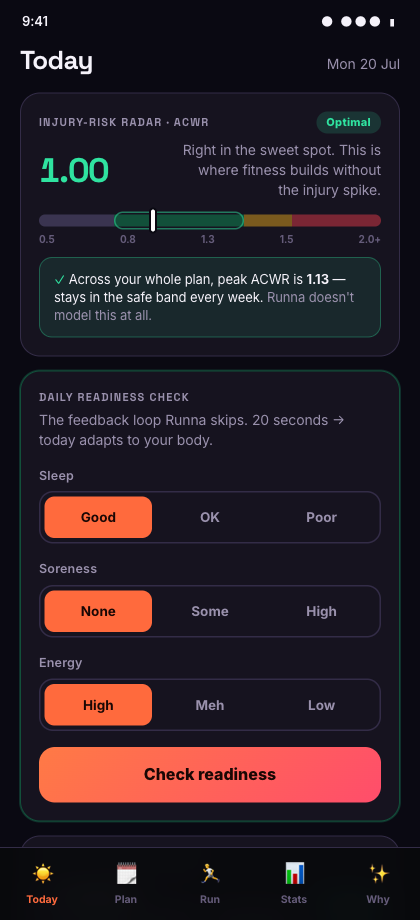
  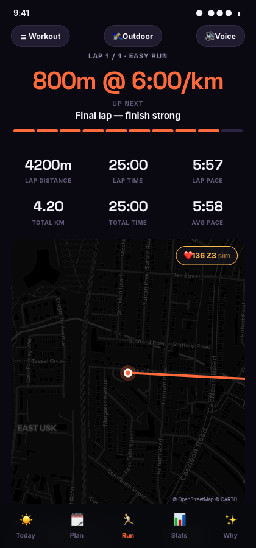
</p>

---

## Screens

<table>
  <tr>
    <td width="33%"></td>
    <td width="33%"></td>
    <td width="33%">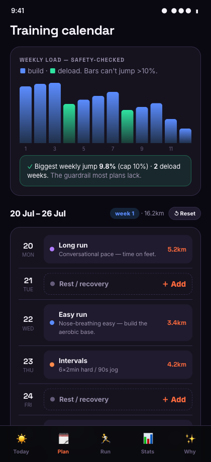</td>
  </tr>
  <tr>
    <td align="center"><b>Pick your goal</b><br><sub>Animated onboarding</sub></td>
    <td align="center"><b>Injury-risk radar</b><br><sub>Live ACWR heat-stress gauge</sub></td>
    <td align="center"><b>Training calendar</b><br><sub>SafeRamp load + deloads</sub></td>
  </tr>
  <tr>
    <td></td>
    <td>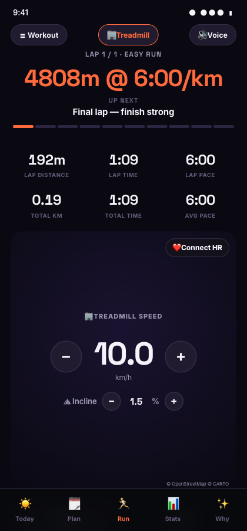</td>
    <td>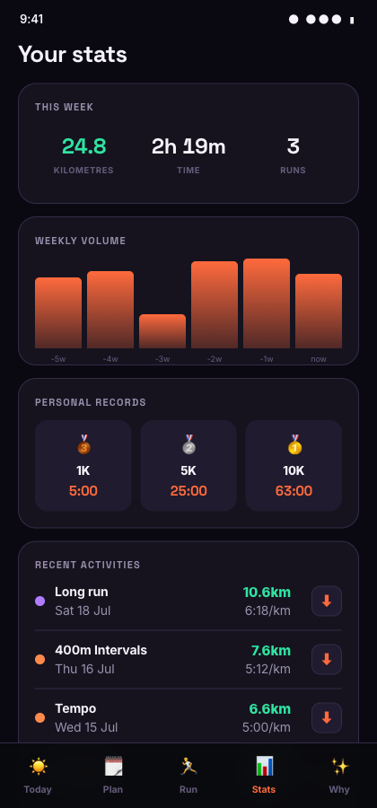</td>
  </tr>
  <tr>
    <td align="center"><b>Live run coaching</b><br><sub>Real map · Bluetooth HR · voice</sub></td>
    <td align="center"><b>Treadmill mode</b><br><sub>Speed-integrated distance</sub></td>
    <td align="center"><b>Stats &amp; records</b><br><sub>PRs + one-tap GPX export</sub></td>
  </tr>
  <tr>
    <td>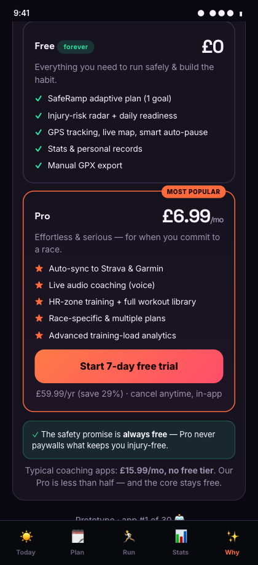</td>
    <td>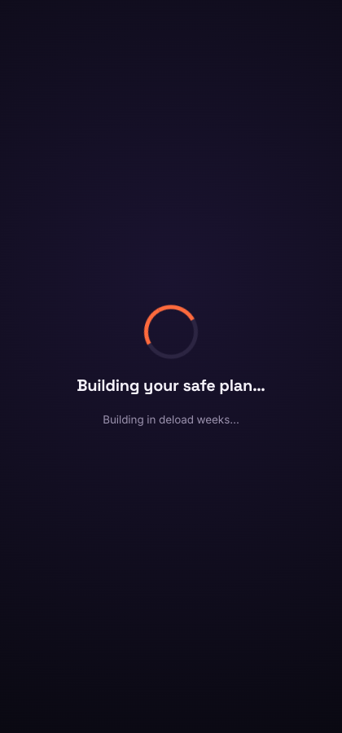</td>
    <td></td>
  </tr>
  <tr>
    <td align="center"><b>Honest free vs Pro</b><br><sub>Safety promise always free</sub></td>
    <td align="center"><b>Plan-building animation</b><br><sub>Neon Aurora theme</sub></td>
    <td></td>
  </tr>
</table>

---

## Why it exists

Most running apps optimise for a plan; **Stride optimises so the plan won't injure you.** Every design choice targets a real, documented failure mode in mainstream running apps:

| Common failure mode | Stride's fix |
|---|---|
| Load ramps too fast → injuries | **SafeRamp** — load mathematically cannot jump >10%/week |
| One-time plan, no feedback loop | **Daily readiness** + **post-run RPE** recalibration |
| GPS undercounts 100–200m at corners | Smoothed distance, no undercount |
| Nags "speed up" at red lights | **Smart auto-pause** |
| No free tier, can't cancel in-app | Real free tier, £6.99 Pro, 1-tap cancel |
| No injury-risk or heat modelling | **ACWR radar** + **wet-bulb heat** safety (sports-science standard) |

---

## Feature map

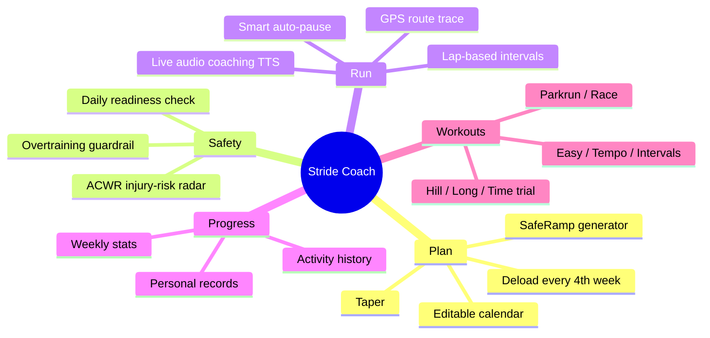

## App navigation

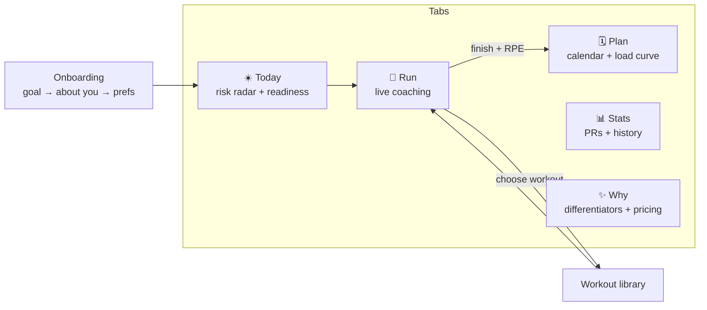

## The injury-safe adaptive loop (our moat)


## SafeRamp — why an unsafe plan is impossible

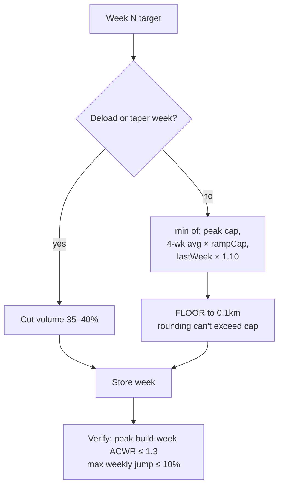

---

## Run it

```bash
cd app
python3 -m http.server 8791
# open http://localhost:8791/index.html  (use a phone / mobile viewport)
```
Or open `app/index.html` directly (GPS tracking needs http/https + location permission; falls back to demo mode otherwise).

## Tech

- **Single-file** `app/index.html` — vanilla HTML/CSS/JS, `localStorage` persistence, zero dependencies.
- Web APIs: **Geolocation** (run tracking), **SpeechSynthesis** (live audio coaching), **SVG** (route trace).
- Theme: **"Neon Aurora"** — deep indigo canvas, electric-tangerine brand, mint green reserved for safety semantics only.
- Portable to Capacitor / React Native for a native app + real watch sync (phase 2).

## Roadmap

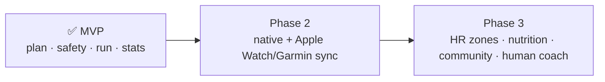

## Repo layout

```
stride-coach/
├── app/
│   ├── index.html      # the whole app
│   ├── README.md       # app-level notes
│   └── screenshots/    # UI captures
├── research/           # market research, competitor analysis, blueprint
├── STATE.md            # autonomous-build resume log
└── README.md           # this file
```

---

*Prototype built autonomously as app #1 of a 30-app sprint. Stride Coach is its own brand and product.*
